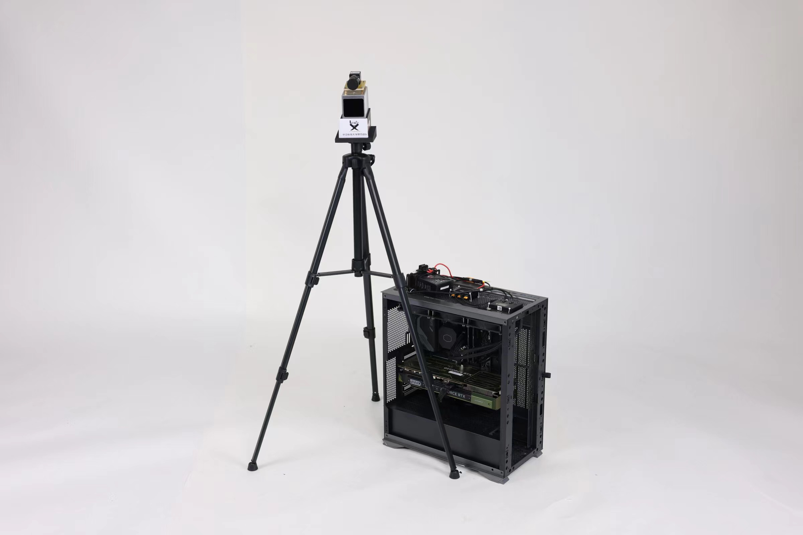

<div align="center" float="left">
<a href="https://www.robomaster.com/zh-CN">

</a>
&nbsp;&nbsp;&nbsp;&nbsp;&nbsp;&nbsp;&nbsp;&nbsp;&nbsp;

</div>
<br>
<div align="center">
<b> 华中科技大学 狼牙战队 视觉组 </b>
 </div>

## 效果展示 🎥
<div align="center">
<h4>
全场高亮
</h4>


<h4>
分区赛效果
</h4>
<div align="center">
<h4>
哨兵-英雄围杀
</h4>


<div align="center">
<h4>
哨兵-辅助感知
</h4>


<div align="center">
<h4>
目标追踪效果展示
</h4>


<div align="left">
国赛效果展示视频：

[华中科技大学狼牙战队雷达](https://www.bilibili.com/video/BV1TMeGedETC/?share_source=copy_web&vd_source=6f2ebe510c8892396ae0b07a82be0d23)

目标检测效果完整展示视频：
[华中科技大学狼牙战队雷达目标检测效果展示](https://www.bilibili.com/video/BV13jHYeoE5z/?share_source=copy_web&vd_source=6f2ebe510c8892396ae0b07a82be0d23)


## 功能简介 🔎

本赛季雷达机器人算法开发的功能主要包括目标追踪与定位、决策辅助与多机通信。

目标检测模块使用了两阶段检测（三阶段未上场），一阶段采用bytetrack实现追踪，二阶段进行分类。该模块进行了较为良好的封装，可以很方便地加入自己的代码中。

决策辅助板块通过简单的场景触发方案，实现了哨兵-辅助感知，哨兵-环高英雄围杀，防守双倍易伤触发等策略。

多机通信方面，通过己方自定义消息，实现了与己方哨兵、步兵的通信，将决策信号与双倍易伤次数等信息发送给己方机器人；通过约定飞镖目标的方法实现了云台手主动触发双倍易伤。

## 环境配置 🛠

### 硬件环境 📡

#### 一、传感器平台

| 硬件     |                           型号                           |
| -------- | :------------------------------------------------------: |
| 工业相机 | 海康威视工业相机 29.2fps@4024*3036 MV-CU120-10UC *1 870r |
| 镜头     |      海康威视 8mm工业镜头 MVL-HF0824M-10MP *1 250r       |
| 激光雷达 |              Livox Mid-70激光雷达 *1 3600r               |

#### 二、算力平台

| 硬件(分区赛版本) | 型号                         |
| ---------------- | ---------------------------- |
| 算力平台         | 英特尔11代NUC幻影峡谷        |
| CPU              | 第 11 代英特尔酷睿 i7-1165G7 |
| GPU              | NVIDIA RTX 2060 Max-P 6GB    |

>主线程约8Hz
>
>检测线程约20Hz
>
>仅运行检测约60Hz

| 硬件(全国赛版本) | 型号                          |
| ---------------- | ----------------------------- |
| 算力平台         | 自组主机                      |
| CPU              | 第 14 代英特尔酷睿 i7-14700kf |
| GPU              | NVIDIA RTX 4090 D             |

>主线程约60Hz
>
>检测线程约25Hz（受限于相机采集帧率）
>
>仅运行检测约200Hz

### 软件环境 🖥

```
MVS
MVS_SDK
ros(noetic)
Livox-SDK
livox-ros-driver

torch
ultralytics
open3d
timm
pyserial
opencv-python
efficientnet_pytorch
cupy
rospy
```

具体配置方法可参考[雷达主机环境配置文档](https://docs.qq.com/doc/DZFFWV3ZJcFVlb3lB?)

### 运行 🚀

从[夸克网盘分享(提取码yqWF)](https://pan.quark.cn/s/f5ef35e24c18)下载video.avi和rosbag.avi，将rosbag.avi后缀改为rosbag.bag后，均放于data文件夹下

##### 1.无硬件环境完整demo（测试中）

**注意：需要插上USB转ttl才可正常运行！**

###### 路径修改：

```python
# 1. 修改main.py中line 18
mode = "video" # "video" or camera
# 2. 修改main.py中line 22
video_path = "path/to/video.avi"
```

###### 终端运行

```shell
roscore
rosbag play path/to/rosbag.bag
# 没做对齐，需迅速启动
python path/to/Hust-Radar-2024/main.py 
```

##### 2.无硬件目标检测模块video-mode

###### 路径修改：

```python
# 1. 确保detect_thread_test.py中line 12
mode = "video" # "video" or camera
# 2. 修改line 16
video_path = "path/to/yout_video.avi"
```

###### 终端运行

```shell
python path/to/Hust-Radar-2024/detect_thread_test.py 
```

##### 3.有硬件环境运行

需确保相机为海康系列,且安装MVS与MVS-SDK

需确保激光雷达为Livox系列，且安装Livox-SDK与livox-ros-driver

1.修改配置文件

```python
# 1. /configs/bin_cam_config.yaml下
id:
    new_cam:<your_id> # 将new_cam的id改为你的相机的id
    
param: # 按需修改为对应的参数
    Width: <your_width> 
    Height: <your_height>
    Gain: <your_gain> # 注意！此处增益一定要小于你相机的最大增益，否则会无法运行
    show_width: <your_show_width> # 可视化时的宽高，按显示器来
    show_height: <your_show_height>

# 2. main.py下
mode = "camera" # "video" or "camera"

# 3.config/main_config.yaml下
global:
    my_color: "Blue" # "Blue" or "Red" 对应颜色，注意大写

lidar:
    lidar_topic_name: <your_lidar_topic_name> # 你的激光雷达发布的话题名称
    
# 4.converter_config.yaml
params:
    width: <camera_width> # 你相机图像的宽
    height: <camera_height> # 相机图像的高
calib:
    # 修改你的相机内参与相机与激光雷达的外参矩阵

```

2.启动激光雷达节点

```shell
roslaunch livox_ros_driver livox_lidar_rviz.launch
```

3.启动程序

```shell
python main.py
```

## 文件目录结构 📂

```shell
.
├── detect		       检测模块
│   ├── _init_.py
│   ├── Capture.py              相机源驱动类
│   ├── Detector.py             目标检测类
│   └── Video.py                视频源类
├── Lidar		       定位模块
│   ├── _init_.py
│   ├── Converter.py            坐标转换类
│   ├── Lidar.py                激光雷达类
│   └── PointCloud.py           自定义点云数据结构
├── communication		通信模块
│   ├── _init_.py
│   ├── Messager.py             通信类
│   ├── Sender.py               发送类
│   ├── Receiver.py             接收类
│   └── Messager_test.py        通信测试
├── Car		            车辆信息数据结构
│   ├── _init_.py
│   └── Car.py                  车辆信息与车辆列表数据结构类
├── configs				配置文件
│   ├── bin_cam_config.yaml		相机驱动文件
│   ├── bytetrack.yaml          bytetrack参数文件
│   ├── converter_config.yaml   相机内外参与converter参数文件
│   ├── detector_config.yaml    检测模型路径与detector参数文件
│   └── main_config.yaml        总参数文件
├── weights/            模型文件夹
├── stereo_camera/      上赛季相机驱动依赖，不敢动
├── camera/             本赛季附加相机驱动依赖
├── Tools/              工具类
├── Log/                Log类
├── ultralytics/        ultralytics魔改包
├── camera.py           仅运行相机
├── detect_thread_test.py  仅运行检测线程
└── main.py             主线程文件
```

## 基本算法阐述 ♾️

### 两阶段检测 🎯

#### 一阶段追踪 🎯

TODO:

#### 二阶段分类 ♾️

TODO:

#### 冲突处理 🚀

TODO:

### 目标定位 🎯

TODO:

### 多机通信🚀

在上赛季我就已有雷达与哨兵等己方机器人联动，让雷达成为真正的团队大脑的设想。本赛季在阅读裁判系统串口附录并与嵌软联调确定可行性后，通过己方机器人自定义信息链路，与己方不同机器人约定一套子id来实现功能信息的发送。本赛季尝试开辟并在雷达方面完成了了四条己方自定义信息子链路，分别为**哨兵预警角**、**哨兵全向感知**、**英雄预警**和**雷达双倍易伤次数转发**。

###### 链路①：哨兵预警角

在赛场坐标系解算己方哨兵与最近的敌方单位的位姿，向哨兵发送：**最近敌方ID、方位角和距离。**

###### 链路②：哨兵全向感知

在赛场坐标系解算己方哨兵与所有敌方敌方单位的坐标，向哨兵发送：**己方哨兵与所有敌方单位的x，y坐标。**

###### 链路③：英雄预警

根据决策功能，判断在敌方英雄位于准备下台阶到上到己方环高的路上时，向哨兵发送：**前往环高增益点夹击英雄的指令。**

###### 链路④：雷达双倍易伤次数转发

将雷达拥有双倍易伤次数转发到己方步兵机器人上，再由步兵嵌软将双倍易伤次数画到操作手ui上，云台手即可通与步兵操作手沟通（窥屏五号操作手，来了解自己是否能通过飞镖目标切换主动触发双倍易伤。

### 双倍易伤决策 🎯

本赛季雷达新增了双倍易伤机制，雷达站可向裁判系统申请触发双倍易伤。本赛季初的目标为能根据赛场情况，**在双倍易伤收益最大的场景触发双倍易伤**，如小团战或者是对面冲家时发动双倍易伤。根据决策的复杂程度与其他功能完成进度，本赛季实现了四个版本。

###### 方案①：持续请求

通信线程中一直请求第一次双倍易伤和第二次双倍易伤，可实现有次数就立即触发双倍易伤的功能。

该方案无法根据赛场形式判断最需要发送的情况，但可以确保能发送两次双倍易伤。

###### 方案②：开环被动请求

在决策系统未完成时，在不依赖裁判系统信息的情况下根据自身检测获取的信息判断请求时机。具体实现为解算到敌方英雄在小地图上位置为己方半场内时，以方案①触发双倍易伤，实现防守时触发。

本方案可以实现一定的策略性触发，但会出现定位偏差而导致误触发等情况，也有敌方英雄整场不冲家导致未启用双倍易伤的情况。

###### 方案③：闭环被动请求

在接收进程修复，决策系统完成后，可以根据赛场的一些状态来实现较为复杂的预设场景下启用双倍易伤，在确保双倍易伤触发的时机精确的同时提高双倍易伤可触发的概率。

通过裁判系统可以读取敌方的血量、标记进度、雷达的双倍易伤可用次数（通过是否处于双倍易伤触发状态的下降沿可计算得出）等信息，再结合自身解算敌方位置信息，可以预设一些状态，如：**敌方英雄在下台阶到上己方环高的那段路上，未死亡且已被标记**；敌方四辆车未死亡且被标记，且敌方英雄3m内有我方步兵等。在这些**预设情况下，请求双倍易伤**，可以实现效益最大化。

本方案在国赛开始时由于接收进程出现问题回退到方案②，但后续修复后，实战验证可以取得良好的效果。

###### 方案④：主动请求

分区赛后，借鉴辽科雷达开源思路，**与云台手约定飞镖目标为随机靶且雷达拥有双倍易伤时，转发双倍易伤请求**。由操作间发出的请求更为准确，配合保底的被动触发方案③，可以实现较为有效地利用双倍易伤。

在与步兵机器人的自定义通信链路调通后，增加了将雷达可使用双倍易伤次数转发到步兵操作手界面上，云台手可通过与步兵操作手沟通了解目前是否可主动请求双倍易伤，让双倍易伤的触发时机更加精确。


## 软件与硬件的系统框图
TODO:

## 未来优化方向 🚀

TODO:

## 致谢 🙏
感谢本赛季狼牙战队视觉组和雷达组的所有成员，感谢他们在这个赛季的努力和付出。

感谢上海交通大学交龙战队等优秀战队的开源引领以及狼牙战队视觉组的老人们的帮助！


## 联系方式 📇

mail: 1035484464@qq.com

QQ:1035484464

如果有用点个star🙏我update的唯一动力🙏🙏🙏

另：有意向交换数据集和原始数据or汇总制作开源数据集的欢迎联系我

